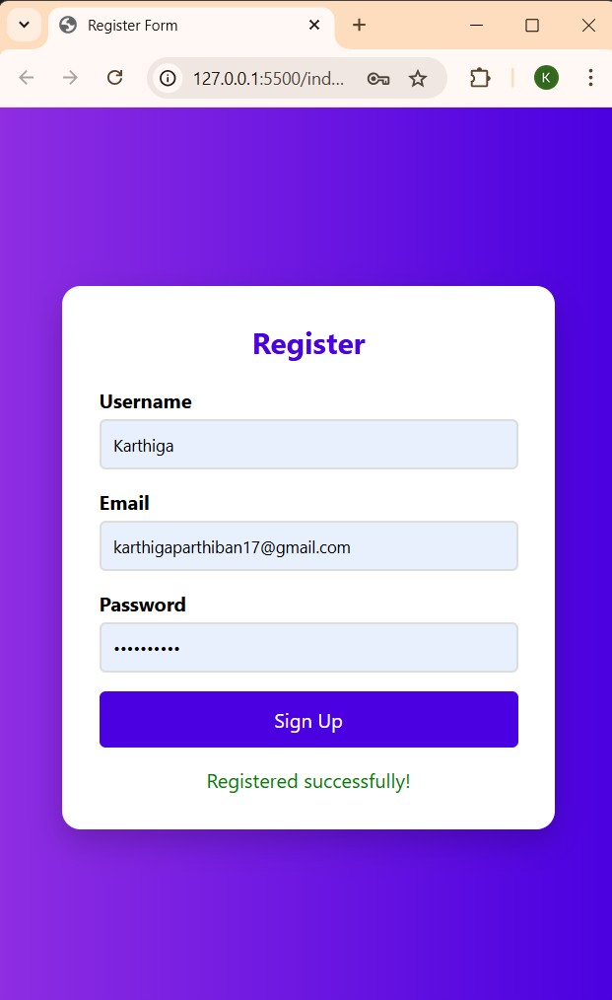

# 📝 Register Form

*Register Form* is a clean and responsive user registration page created using *HTML, **CSS, and **JavaScript*. It validates input fields like username, email, and password and provides instant feedback to users.

## 🌟 Features

* *Interactive UI*

  * Simple and elegant layout
  * Highlighted input focus styles

* *Form Validation*

  * Username must be at least 3 characters
  * Email must include @
  * Password must be at least 6 characters
  * Displays success and error messages

* *Responsive Layout*

  * Mobile-first design
  * Looks great on all devices

## 🧰 Technologies Used

* HTML5
* CSS3
* JavaScript 

## 📁 Folder Structure

Register-Form/
│
├── Screenshots/
│   ├── homepage.jpg               # Screenshot of the full form UI
│   ├── ResponsiveView.jpg         # Responsive/mobile layout view
│   └── warningMessage.jpg         # Sample of validation error message
│
├── index.html                     # Main HTML file
├── style.css                      # CSS for styling
├── script.js                      # JavaScript for form validation
└── README.md                      # Project documentation

## 📸 Screenshots

### 🖥 Home Page

### 📱 Responsive View

### ⚠ Warning Message

## 👩‍💻 Author

*Developed by:* [Karthiga P](https://github.com/KarthigaP20)

## 🚀 Live Demo

[Live Link] (https://karthigap20.github.io/Register-form/)

## 💬 Feedback

If you have suggestions or improvements, feel free to open an issue or contribute.

Made with 💙 using HTML, CSS, and JavaScript.
